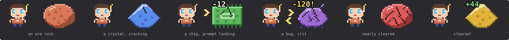

# Token Tycoon 🤖

A Claude-themed idle game that lives above your [Claude Code](https://claude.com/claude-code) prompt. A little bot chips away at a task block; you prompt it, hire agents, upgrade your model and infra, and your real Claude Code work counts too. Think Idle Mine, but the ore is a backlog.



## How it plays

- **The block is a task:** "Fix the flaky test", "Refactor auth", "Ship v2", "Achieve AGI"… Each has HP and takes a shape in turn: an ore rock, a crystal, a chip, a bug. It cracks as it takes damage and changes color with every task.
- **Prompt ⚡** hits it for your prompt power. 5% of hits are crits for ×10. Clear a task and it pays tokens ✦; the next one has more HP and pays more.
- **Agents hit it for you**, every second, even while you type: Agents → Subagents → Robots → Agent swarms. Each one you buy costs 17% more, and owning 10, 25, 50, 100, 200 or 400 of a kind doubles that kind, every time.
- **Sprints:** every ten tasks is a sprint. Task HP grows 33% per task, so each sprint needs the next tier of agents and upgrades to keep pace.
- **Upgrades:**
  - **Models** multiply your prompt power: Haiku ×1 → Sonnet ×3 → Opus ×10 → Fable ×30 → Mythos ×100.
  - **Infra** multiplies your agents: Laptop → GPU ×2 → Rack ×4 → Data center ×8 → Cluster ×16.
  - **Tools**, one-off: Read (agents +25%), Edit (prompts +50%), Bash (20% chance a prompt hits twice), Grep (crit chance 5% → 15%), WebSearch (offline earnings run twice as long).
- **Your real work counts:**
  - every tool call Claude makes is a free hit
  - every finished turn is a guaranteed crit
  - while you're away your agents keep working at half pace, up to 4 hours (8 with WebSearch), paid out when you come back
- **Train a new model** (prestige): once you've earned 250K ✦ in a run, reset for a permanent point. Every point is +50% to prompts and agents, forever. Points scale with the square root of what you earned, so a 1M run is worth two.
- **The band** above the prompt shows the task, its progress bar, your tokens, income per second and power per hit, with **Prompt ⚡** and **Shop 🛒** buttons and a faint *hide* in the corner. Once the band has focus (ctrl+x tab in the terminal), `p` prompts.
- **`/idle`** opens the shop pane (and prints where you stand). While the pane has focus, the digit and letter on each button buy things: `1`–`4` agents, `m` model, `i` infra, `r` `e` `b` `g` `w` tools, `t` train, `p` prompt.
- **Saved across sessions** every 15 seconds and after each turn, play time included: the shop's Stats card shows how much you've gathered and how long you've played. Toasts for upgrades, offline earnings and the odd bonus crit; turn them off with the Popups button in the shop.

In the Claude desktop app the scene is an SVG that animates itself (the bot's arm swings, the block shakes when a hit lands, damage numbers float up). In the terminal it's a cell grid of colored half blocks. Either way the mod only redraws when something changes, at most once a second.

## Install

You need a Claude Code version that supports mods (October 2026 or later). The same steps work on macOS, Linux and Windows. At the Claude Code prompt, type:

```
/plugin install token-tycoon --marketplace matthlh/claude-idle-mod
```

Answer `y` to add the marketplace, then press Enter to install it for your user. The game shows up right away, and in every new session after that, desktop app included.

Or from a shell:

```bash
claude plugin marketplace add matthlh/claude-idle-mod
claude plugin install token-tycoon@matthlh-idle
```

Update with `claude plugin update token-tycoon@matthlh-idle`, remove with `claude plugin uninstall token-tycoon@matthlh-idle`.

**Nothing above the prompt?** Mods are still rolling out. Add `"CLAUDE_CODE_ENABLE_FUNCTION_HOOKS": "1"` to the `env` block of `~/.claude/settings.json` and start a new session.

### From a clone

To change the game, run your own copy instead:

```bash
git clone https://github.com/matthlh/claude-idle-mod ~/.claude/mods/token-tycoon
claude --plugin-dir ~/.claude/mods/token-tycoon
```

To load the clone in every session, including the desktop app, put its full path in the `env` block of `~/.claude/settings.json`:

```json
{
  "env": {
    "CLAUDE_CODE_PLUGIN_DIRS": "/Users/<you>/.claude/mods/token-tycoon",
    "CLAUDE_CODE_ENABLE_FUNCTION_HOOKS": "1"
  }
}
```

| OS | Path | Separator for several folders |
| --- | --- | --- |
| macOS | `/Users/<you>/.claude/mods/token-tycoon` | `:` |
| Linux | `/home/<you>/.claude/mods/token-tycoon` | `:` |
| Windows | `C:\\Users\\<you>\\.claude\\mods\\token-tycoon` (JSON needs the doubled `\\`) | `;` |

Write the full path. Older versions don't expand `~` here, so `~/.claude/mods/token-tycoon` silently loads nothing. Sessions already open when you change settings pick it up only after a restart (quit the desktop app fully, not just the window).

## Tuning

All the numbers live at the top of [`hooks/register.tsx`](hooks/register.tsx): the task names (`TASKS`), the agents (`GENS`), the model and infra tiers (`MODELS`, `INFRA`), the tools (`TOOLS`), task HP and rewards (`taskHp`, `taskReward`, 33% more HP per task), the crit multiplier, the agent milestones (`MILESTONES`) and how many tokens a prestige point costs (`POINT_EVERY`). The sprites are letter grids just below: a 16×18 bot and four 24×18 task shapes, drawn at 2 CSS pixels per cell on the desktop and shrunk to half for the terminal.

Check your changes with:

```bash
claude plugin validate ~/.claude/mods/token-tycoon
claude plugin test ~/.claude/mods/token-tycoon
```

The save lives in the plugin's store, so edits to the code never reset your progress.

## See also

[Claude Cat](https://github.com/matthlh/claude-cat-mod), a pixel cat for the same spot above the prompt. They get along fine side by side.

## License

MIT
